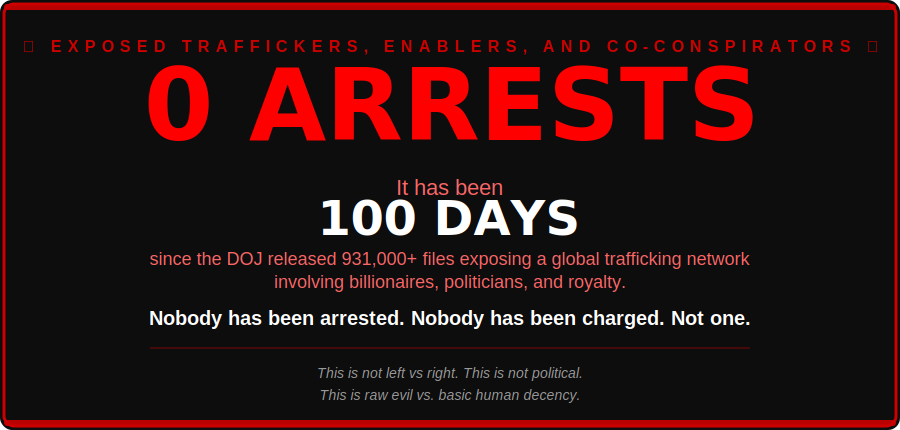

<div align="center">



<br/>

> **Children were raped by the most powerful people on the planet.**
> **The evidence is public. The names are known. The flight logs exist.**
> **And every single one of them is still free.**

---

</div>

> [!CAUTION]
> The DOJ released ~931,000 files exposing a global child sex trafficking network — then **removed bulk download links** and forced individual file retrieval across 931,000 PDFs to make access as difficult as possible. This repository exists to make sure nothing disappears without a record.

## What This Repo Does

This repository **automatically monitors** the DOJ Epstein Files index every 6 hours:
- Detects **new files** added to any dataset
- Detects **files quietly removed** or altered
- Detects **new datasets** appearing beyond the current 12
- Maintains a running **changelog** of every change
- Updates the day counter above — it keeps going up until someone is in handcuffs

No PDFs are stored here — only the manifest/index.

## Key Numbers

| | |
|---|---|
| **Total files released** | ~931,000 PDFs |
| **Total size** | ~360 GB |
| **Datasets** | 12 |
| **Arrests since release** | **0** |
| **First release** | Dec 19, 2025 |
| **Major dump** | Jan 30, 2026 (~3.5 million pages) |
| **ZIP downloads killed by DOJ** | Feb 11, 2026 |
| **Victims represented** | 200+ |
| **Pages entirely blacked out** | 500+ |

## The 12 Datasets

| DS | Files | Size | Contents |
|----|-------|------|----------|
| 1 | ~3,150 | 1.23 GB | FBI 302s, police reports |
| 2 | ~600 | 630 MB | FBI 302s, police reports |
| 3 | ~49+ | 595 MB | FBI 302s, police reports |
| 4 | ~200 | 351 MB | FBI 302s, police reports |
| 5 | ~150 | 61 MB | FBI 302s, police reports |
| 6 | 12 | 51 MB | FBI 302s, police reports |
| 7 | 16 | 97 MB | FBI 302s, police reports |
| 8 | ~11,000 | 10.7 GB | FBI 302s, police reports |
| 9 | 533,786 | ~143 GB | Emails, private correspondence, DOJ internal docs |
| 10 | 50,403 | 78.6 GB | 180K images + 2K videos from Epstein properties |
| 11 | 331,655 | 25.5 GB | Flight manifests, financials, seizure records |
| 12 | ~150 | 114 MB | Late productions, supplemental |

## How It Works

A GitHub Action runs `tools/monitor.py` every 6 hours:

1. Checks DOJ listing pages for each dataset (page 1 + last page)
2. Checks for new datasets beyond the current 12
3. Spot-checks random files from the manifest via HEAD requests
4. Compares against stored manifests in `manifests/`
5. Logs all changes to `CHANGELOG.md`
6. Auto-commits if anything changed

### Manual Seed

To build the initial file index from scratch:

```bash
pip install -r tools/requirements.txt
python tools/monitor.py --seed
```

## Project Structure

```
├── .github/workflows/monitor.yml   # Scheduled monitoring action
├── banner.svg                      # Auto-generated arrest counter banner
├── tools/
│   ├── monitor.py                  # Main monitoring script
│   └── requirements.txt            # Python dependencies
├── manifests/
│   ├── dataset-01.csv              # Per-dataset file manifests
│   ├── ...
│   ├── dataset-12.csv
│   └── summary.json                # Aggregate stats
├── NOTES/
│   ├── timeline.md                 # Full timeline 2005-2026
│   ├── names.md                    # All named individuals
│   ├── notes.md                    # Key findings
│   ├── tools.md                    # Community download tools
│   └── doj-website-analysis.md     # DOJ site structure analysis
├── CHANGELOG.md                    # Running log of detected changes
└── README.md
```

## Why This Matters

On Feb 1, 2026, attorneys for **200+ victims** asked federal judges to take down the DOJ Epstein website, calling it *"the single most egregious violation of victim privacy in one day in United States history."* The DOJ had failed to redact victim names and accidentally published unredacted nude images of young women.

On Feb 10, Rep. Ro Khanna read **6 names** from unredacted files on the House floor — people he said are *"likely incriminated."* The Deputy AG called them *"completely random people."*

On Feb 11, the DOJ **removed all bulk download links**. You can no longer download datasets as ZIP files. Only individual PDFs, one at a time, across 931,000 files.

On Feb 12, Goldman Sachs CLO **Kathryn Ruemmler** announced her resignation after files revealed she was one of three people Epstein called after his 2019 arrest. People are running. Nobody is chasing.

They are not hiding this because they want transparency. They are hiding this because the names on those flight logs and in those emails belong to people who are still in power.

## Sources

- [DOJ Epstein Library](https://www.justice.gov/epstein)
- [Epstein Files Transparency Act (PL 119-38)](https://www.congress.gov/bill/119th-congress/house-bill/4405)
- [PBS Timeline](https://www.pbs.org/newshour/politics/a-timeline-of-the-jeffrey-epstein-investigation-and-the-fight-to-make-the-governments-files-public)
- [NPR: Epstein Europe Fallout](https://www.npr.org/2026/02/14/nx-s1-5714609/epstein-europe-fallout)
- [Community Downloads: Surebob/epstein-files-downloader](https://github.com/Surebob/epstein-files-downloader)
- [Community Archive: yung-megafone/Epstein-Files](https://github.com/yung-megafone/Epstein-Files)
